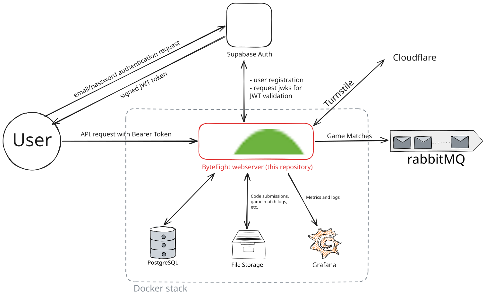

# ByteFight Webserver
This repository contains the code for the backend webserver of ByteFight. The responsibility of the webserver is to maintain the authoritative state of ByteFight's platform. Specifically, the webserver manages team/player data, bot code submissions, match scheduling and results, tournament bracket progression, and team ratings using the Glicko-2 system.



## Project Structure
The webserver is organized into decoupled modules, each handling a specific aspect of the platform. Below are a few of the most important ones:
- `auth/` - Authentication and user management
- `user/` - User account management
- `team/` - Team management
- `player/` - Player profiles and stats
- `competition/` - Competition management
- `tournament/` - Tournament bracket creation and scheduling
- `ladder/` - Ladder and ranking system
- `leaderboard/` - Leaderboard generation and ranking
- `gamematch/` - Match scheduling and coordination
- `matchmaking/` - Matchmaking algorithm
- `submission/` - Bot submission handling
- `storage/` - File storage service
- `glicko/` - Glicko-2 rating system

## Configuration

HIGHLY RECOMMENDED: Use Intellij. The information in this README assumes you are using IntelliJ. it does not matter if you have IntelliJ ultimate.

Must have Java 17 installed and set in project. To do so:
```
file > Project Structure > Project > SDK
```
Also set the Language level to SDK default. If you have OpenJDK 17 from Oracle, use that. Else, you can download Amazon Corretto 7.0.13 from Intellij Directly if you click Download JDK in SDK

# Making Changes

To make changes create a branch with a name corresponding to the feature you are developing. For example, the branch corresponding to updating the ranking system to use glicko rather than elo was named 
```
glicko_branch
```
Of course, the fact that this is a branch is implied, and you probably don't need to specify that in the branch name. 

Once you are done making your changes, create a pull request merging into main. This should trigger GitHub actions that verify your code passes the necessary tests before allowing you to merge. Send your PR to infrastructure lead (currently Tyler) for review. Once your code passes the CI checks, and is approved by the lead, merge your code.

Working on this repository should NOT require production database or storage access. Instead, verify that your changes work via unit/integration tests provided. When working on a specific component dependent on other components, it should be assumed that the other components work as intended. For this reason, when testing, use Mocks. More information about mock testing can be found int the [Mockito Docs](https://site.mockito.org/)
