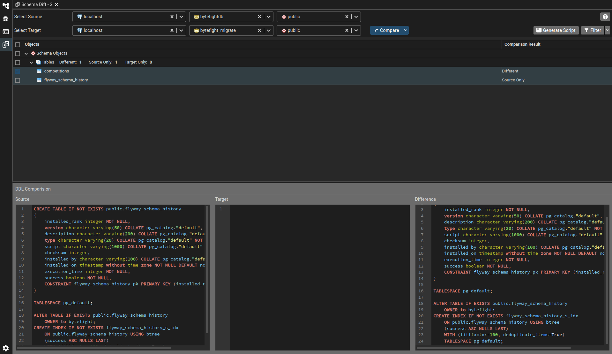

# How to create a database migration

This project uses **DBML for schema design** and **Flyway for schema migrations**.

The goal is to get the best of both worlds:

- DBML = human-readable schema source of truth
- Flyway = deterministic, versioned database changes
- Git = full audit history of both design and execution

### Step 1. Generate complete .sql file from DBML
This can be done through the official compiler or a website such as dbdiagram.io

### Step 2. Create a new database with the new schema beside the database with the current schema
I like to work in docker containers for this. Thus, I usually first copy the .sql file from step 1 to my docker container:

```shell
docker cp 'ByteFight.sql' bytefight-webserver-dev-db-1:/
```

Then, I create a new empty database called `bytefight_migrate`, dropping it if it currently exists:

```shell
dropdb -U bytefight bytefight_migrate
createdb -U bytefight bytefight_migrate
```
Finally, I apply the .sql schema file to the new `_migrate` database

```shell
psql -U bytefight -d bytefight_migrate -f ByteFight.sql
```

### Step 3. Create a diff file to apply as a Flyway migration
If you pay for Flyway they include a diffing tool. But we don't want to pay for flyway. Thankfully, we can do the same thing with pgadmin4 for free:



### Step 4. Add the migration
Create a new file in `src/main/resources/db/migration` named `V#__desc`, where # is replaced with the next consecutive number and `desc` is a very short description of the changes made. Provide an extended summary of your migration in your commit message.